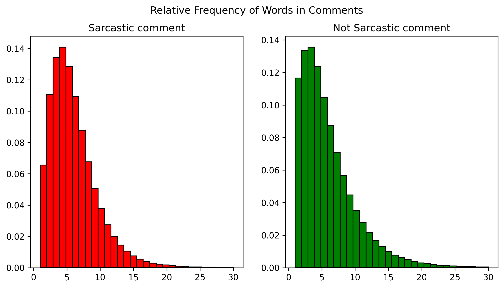

# Sarcasm Detector
2025 Spring\
Diablo Valley College\
Project Bracket

Gifs retrieved from [tenor.com](https://tenor.com).

---

### __Team__

Johnson Liu ( project manager )\
GitHub: [@johnson-liu-code](https://github.com/johnson-liu-code)\
Email: [liujohnson.jl@gmail.com](mailto:liujohnson.jl@gmail.com)

Heidi - [@heidi415D](https://github.com/heidi415D)

Bryan - [@hBrymiri](https://github.com/hBrymiri)

---

### __Contents__

1. [Project Overview](#project-overview)\
    1.1. [Introduction](#background)\
    1.2. [Purpose](#purpose)\
    1.3. [Data Used](#data-used)\
    1.4. [Variable Definitions](#variable-definitions)\
    1.5. [Mathematical Foundations](#mathematical-foundations)\
    1.6. [Workflow](#workflow)
2. [Resources](#resources)\
    2.1. [Data](#data)\
    2.2. [Theoretical Foundations](#theoretical-foundations)\
&nbsp;&nbsp;&nbsp;&nbsp;&nbsp;&nbsp;2.2.1 [Natural Language Processing](#natural-language-processing)\
&nbsp;&nbsp;&nbsp;&nbsp;&nbsp;&nbsp;2.2.2 [word2vec Model](#word2vec-model)\
&nbsp;&nbsp;&nbsp;&nbsp;&nbsp;&nbsp;2.2.3 [GloVe Model](#glove-model)\
    2.3. [Sample Works](#sample-works)\
    2.4. [Documentation and Tutorials](#documentation-and-tutorials)\
&nbsp;&nbsp;&nbsp;&nbsp;&nbsp;&nbsp;2.4.1. [Neural Networks](#neural-networks)\
&nbsp;&nbsp;&nbsp;&nbsp;&nbsp;&nbsp;2.4.2. [Gensim](#gensim)\
    2.5. [Other Theoretical Backgrounds](#other-theoretical-backgrounds)\
    2.6. [Mathematical References](#mathematical-references)\
    2.7. [Data Visualization Guides](#data-visualization-guides)
3. [Data Visualization](#data-visualization)
4. [Machine Learning Visualization](#machine-learning-visualization)
5. [Results](#results)
6. [Future Direction and Possible Improvements](#future-direction-and-possible-improvements)
7. [Important Dates](#important-dates)
8. [Records](#records)

---

### __Project Overview__

#### __Background__
... text here ...

#### __Purpose__
... text here ...

#### __Data Used__
... text here ...

#### __Variable Definitions__

See reference [2. GloVe model](#theoretical-foundations) in the Theoretical Functions section.
1. $V$ is the set of all unique words that appear in the corpus.

1. $X$ is the co-occurrence matrix for every possible pair of words $i$ and $j$ from $V$.

1. $X_{ij}$ is the $i$-th row, $j$-th column entry in $X$ which gives the number of times word $j$ appears in the context of word $i$.

1. $X_i = \sum_{k \in V} X_{ik}$ is the sum of the number of times every word $k$ appears in the context of word $i$, with the exception of word $i$. Although repeated instances of word $i$ are also counted in the context of word $i$.

1. ...
1. .... 
1. more stuff ...

#### __Mathematical Foundations__
... text here ...

#### __Workflow__

GloVe model
1. Collect data
    1. 
    1. Remove stopwords and punctuation
    1. Generate vocabulary
    1. 
1. Compute co-occurrence probability matrix
    1. Compute co-occurence matrix with specified context window size.
    1. Compute probabilities.
    1. 
1. Train word vectors for each unique word.
    1. ...text here...
    1. 
1. Train neural network
    1. Find the Frechet mean for each comment.
    1. Use a comment's Frechet mean as input for the neural network.
    1.
1. 

---

### __Resources__

#### __Data__
1. [*Sarcasm on Reddit* (Kaggle dataset with Reddit posts classified as either sarcastic or not sarcastic).](https://www.kaggle.com/datasets/danofer/sarcasm/data?select=train-balanced-sarcasm.csv)

#### __Theoretical Foundations__

##### <ins>Natural Language Processing</ins>
1. [Natural language processing (Wikipedia article).](https://en.wikipedia.org/wiki/Natural_language_processing)

1. [*Text Classification & Sentiment Analysis* (blog post).](https://mlarchive.com/natural-language-processing/text-classification-sentiment-analysis/)

1. [*Text Embeddings: Comprehensive Guide* (blog post).](https://towardsdatascience.com/text-embeddings-comprehensive-guide-afd97fce8fb5/)

1. [*Word Embeddings – Explained!* (blog post).](https://towardsdatascience.com/word-embeddings-explained-c07c5ea44d64/)

##### <ins>word2vec Model</ins>
1. [*Word2Vec: NLP with Contextual Understanding* (theoretical guide for word2vec and GloVe models).](https://mlarchive.com/natural-language-processing/word2vec-nlp-with-contextual-understanding/)

1. [Word2vec model (Wikipedia article).](https://en.wikipedia.org/wiki/Word2vec)

1. [*CBOW — Word2Vec* (continous bag of words and word2vec models).](https://medium.com/@anmoltalwar/cbow-word2vec-854a043ee8f3)

1. [*Efficient Estimation of Word Representations in Vector Space* (original academic paper).](https://arxiv.org/abs/1301.3781v3)

##### <ins>GloVe Model</ins>
1. [GloVe model (Wikipedia article).](https://en.wikipedia.org/wiki/GloVe)

1. [*GloVe: Global Vectors for Word Representation* (original manusript/academic paper).](https://nlp.stanford.edu/pubs/glove.pdf)

#### __Sample Works__
1. [*Sarcasm Detection with GloVe/Word2Vec* (project on Kaggle applying the word2vec and GloVe models to classifying news headlines from _The Onion_ and the _The Huffington Post_).](https://www.kaggle.com/code/madz2000/sarcasm-detection-with-glove-word2vec-83-accuracy)

#### __Documentation and Tutorials__

##### <ins>Neural Networks</ins>
1. [*Your First Deep Learning Project in Python with Keras Step-by-Step* (building and training a neural network in Python with Keras).](https://machinelearningmastery.com/tutorial-first-neural-network-python-keras/)

1. [*Your First Deep Learning Project in Python with Keras Step-by-Step* (tutorial on building neural networks in Python (_GeeksforGeeks_)).](https://www.geeksforgeeks.org/training-a-neural-network-using-keras-api-in-tensorflow/)

1. [*Python AI: How to Build a Neural Network & Make Predictions* (tutorial on building your own neural network in Python from scratch (_Real Python_)).](https://realpython.com/python-ai-neural-network/) 

#### <ins>Gensim</ins>
1. [*Gensim Word2Vec Tutorial* (notebook posted on Kaggle by one of the developers of Gensim).](https://www.kaggle.com/code/pierremegret/gensim-word2vec-tutorial)

1. [*Word2vec embeddings* (word2vec module documation from the Gensim website).](https://radimrehurek.com/gensim/models/word2vec.html)

1. [*Word2Vec Model* (word2vec tutorial from the Gensim website).](https://radimrehurek.com/gensim/auto_examples/tutorials/run_word2vec.html)

#### __Other Theoretical Backgrounds__
1. [*Machine Learning Tutorial* (general overview/tutorial on machine learning (_GeeksforGeeks_)).](https://www.geeksforgeeks.org/machine-learning/)

1. [*AI ML DS - How To Get Started?* (general overview on artificial intelligence, machine learning, and data science (_GeeksforGeeks_)).](https://www.geeksforgeeks.org/ai-ml-ds/)

1. [Bag of words model (Wikipedia article).](https://en.wikipedia.org/wiki/Bag-of-words_model)

1. [Logistic regression (Wikipedia article).](https://en.wikipedia.org/wiki/Logistic_regression)

1. [Multinomial logistic regression (Wikipedia article).](https://en.wikipedia.org/wiki/Multinomial_logistic_regression)

1. [Least squares (Wikipedia article).](https://en.wikipedia.org/wiki/Least_squares)

1. [Tf-idf [ term frequency-inverse document frequency ] (Wikipedia article).](https://en.wikipedia.org/wiki/Tf%E2%80%93idf)

#### __Mathematical References__

1. [Dot product (Wikipedia article).](https://en.wikipedia.org/wiki/Dot_product)

1. [Cosine similarity (Wikipedia article).](https://en.wikipedia.org/wiki/Cosine_similarity)

1. [Linear least squares (Wikipedia article).](https://en.wikipedia.org/wiki/Linear_least_squares)

1. [Fréchet mean (Wikipedia article).](https://en.wikipedia.org/wiki/Fr%C3%A9chet_mean)

#### __Data Visualization Guides__
1. [*The Art of Effective Visualization of Multi-dimensional Data* (guide on plotting multidimensional data).](https://towardsdatascience.com/the-art-of-effective-visualization-of-multi-dimensional-data-6c7202990c57/)

1. [*Top Python Data Visualization Libraries in 2024: A Complete Guide*](https://www.fusioncharts.com/blog/best-python-data-visualization-libraries/)

1. [*A Complete Beginner’s Guide to Data Visualization*](https://www.analyticsvidhya.com/blog/2021/04/a-complete-beginners-guide-to-data-visualization/)

1. [*Tableau for Beginners: Data Visualisation Made Easy*](https://www.analyticsvidhya.com/blog/2017/07/data-visualisation-made-easy/)

1. [*Intermediate Tableau guide for data science and business intelligence professionals*](https://www.analyticsvidhya.com/blog/2018/01/tableau-for-intermediate-data-science/)

---

### __Data Visualization__

_**Preliminary figures.\
Not for use in final product.**_

#### Word cloud - Sarcastic

#### Word cloud - Not Sarcastic

#### Word frequency within comments

#### Co-occurrence probabilities

---

### __Machine Learning Visualization__

_**Figures used for testing.\
Not for use in final product.**_

---

### __Results__
... text here ...

---

### __Future Direction and Possible Improvements__
... text here ...
1. Extend project to sentiment and tone classificaiton of text.
1. 

---

### __Important Dates ( taken from club-provided syllabus )__

##### <ins>Week 5/6 — April 16 & April 23, 2025</ins>
Development continues on in week 5 in preparation for the **mid-semester showcase in week 6**. Groups are now in the middle of the semester meaning that they will present what progress they have so far. The mid-semester showcase does not mean that groups have to be halfway done with their projects.

##### <ins>Week 7 — April 30, 2025</ins>
At this point **groups should be more than halfway done with their project** or close to finished in preparation for the final week as well as finals. Project managers should check with members on the final schedule to ensure projects are done and not rushed in the final week.

##### <ins>Week 8 — May 7, 2025</ins>
**Groups should be close to wrapping up their projects** or should be completely done with the projects. This week will be focused mainly on the final project showcase in which judges will determine who has the best project. Groups may want to **prepare ahead of time with presentations**, graphics, and props to enhance their presentations.

---

### __Records__

#### <ins>20250404</ins>

##### Notes
— Johnson
1. Heidi and Brymiri, I will be using this file to keep track of out progress and to assign tasks amongst the team members.
2. I will also use this file to keep track of important dates specified by the club.
3. Please use this file to record any important thoughts that you come up with during the course of the project.
4. You can also use this file to add important notes that you want the team to remember.

##### To-do —
###### For Johnson:
1. [x] Create Github repository.
1. [x] Look up relavant resources.
1. [x] Look up relavant data.
1. [ ] Plan out our timeline and general to-do's / tasks for each team member.

---

#### <ins>20250408</ins>

##### To-do —
###### For Heidi:
1. [x] Review the theoretical resources and begin drafting a short write-up for our team to reference.
1. [ ] Optional - Also look up introductory machine learning resources to clarify specific topics in the write-up, especially if you think they’d be helpful for the team.

###### For Bryan:
1. [ ] Write code to extract a specific Reddit post, along with its parent post and the name of the subreddit where it was posted.

---

#### <ins>20250412</ins>

##### Notes
— Johnson
1. Organized files into folders based on their purpose for better structure and clarity.
2. Expanded and refined the files used for data extraction.
3. Developed files dedicated to data visualization.
4. Generated figures to help us better understand the data.

---

#### <ins>20250418</ins>

##### To-do —
###### For Heidi:
1. [ ] Experiment / explore with creating and training neural networks.
1. [ ] Familiarize yourself with the use of the Gensim Python module for word vectors.
1. [ ] Start building and training neural networks to take in word vectors as input and outputs a binary classification ( sarcastic or not sarcastic ).

###### For Bryan:
1. [ ] Continue working on code to extract a specific comment from Reddit along with its parent comment and subreddit name.
2. [ ] Possible future feature: create an app that can be used in the browser to predict whether a selected comment is sarcastic or not.

---

#### <ins>20250421</ins>

##### To-do —
###### For Heidi:
1. [ ] Continue updating WriteUp.md as you better understand the theory behind the word embedding and machine learning techniques used in the project.

###### For Johnson:
1. [ ] Start documenting the directory structure and its organization.
1. [ ] Start documenting the workflow and the theory and mathematics behind each model that we use.
    1. Data collection, extraction, and cleaning.
    1. Data visualization.
    1. Word embedding.
    1. Neural network training.

---